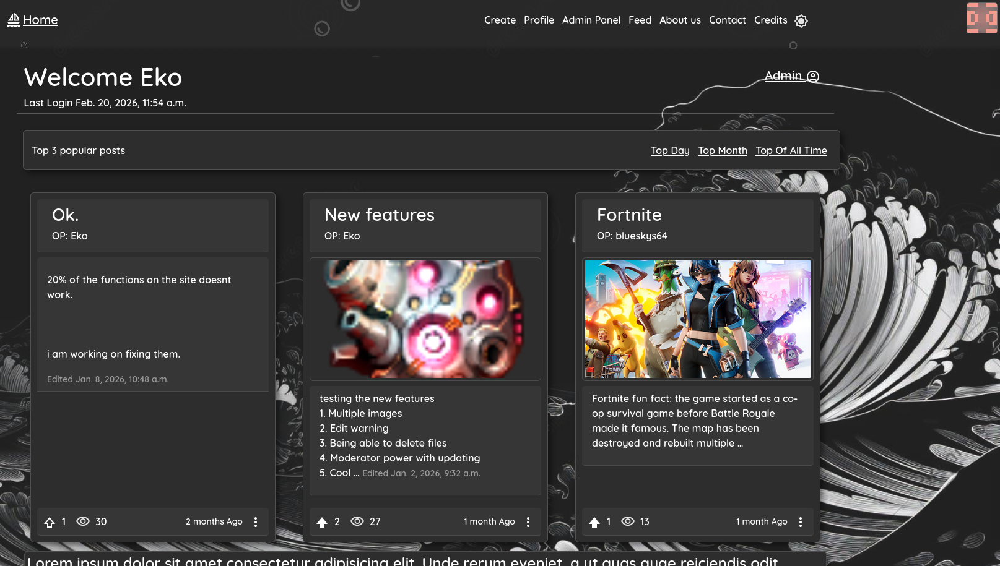
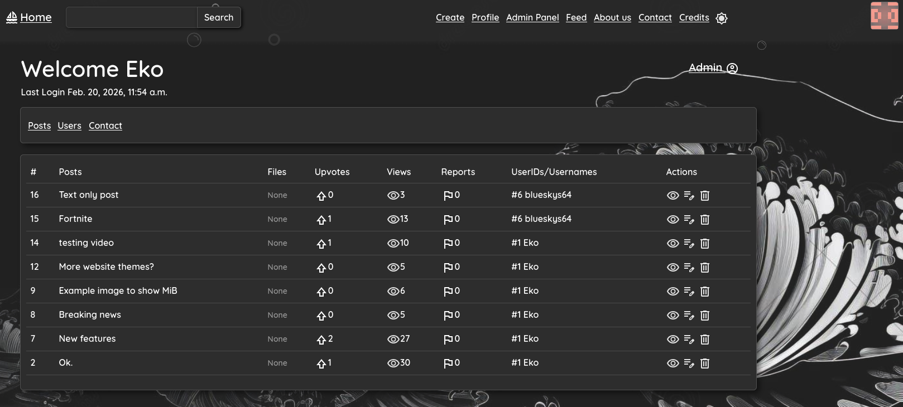
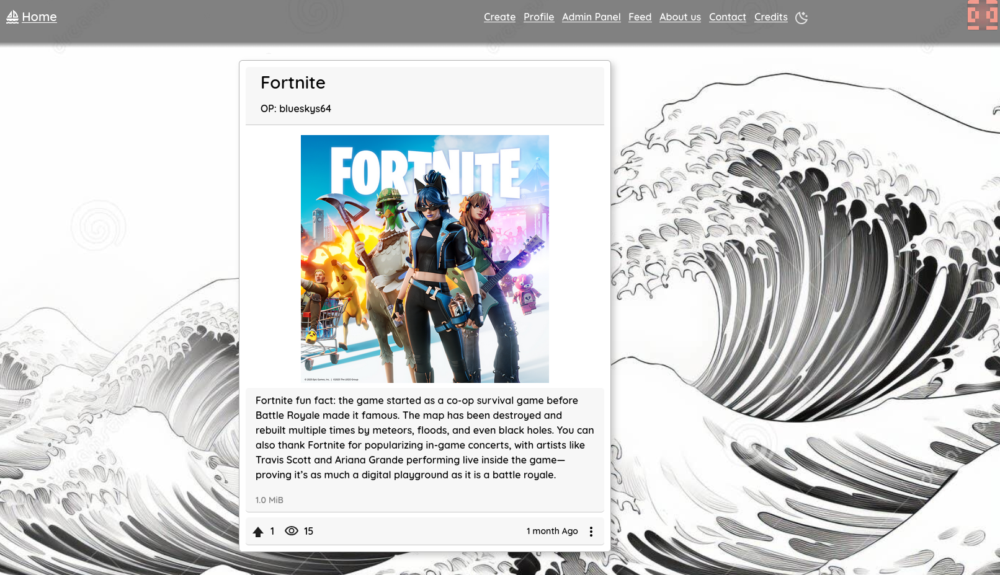
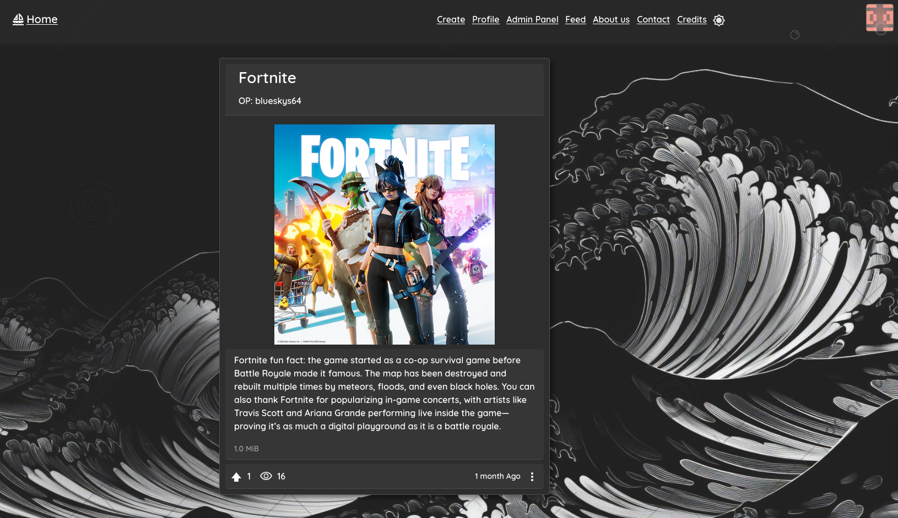
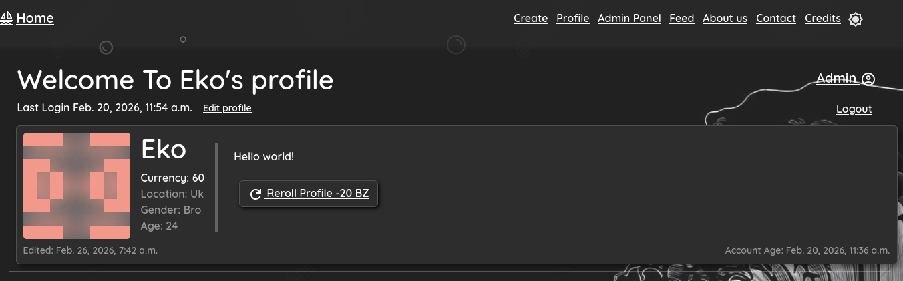

<h1>The Django Project</h1>

<h2>About the Django Project</h2>

This project is a social media web platform made with django.
It can do alot of things listed bellow.

<h3>1.What it can do</h3>
 
You can look at the Top Posts, 
Create your own Posts,   
Upvote,
View and Comment on others.  
Upload videos, images, html, css, js and many more files!

 

If you are admin you can have access to the admin panel, it allows you to See the selected category and Users Delete(Deactivate) and update user permisions.  
And admins have the power to modify and delete your posts.  
The website has a Contact feature, where you can send details for an admin to see and contact you. 
 

<h3>2.App Contents</h3>
I will try to describe what each app does and contains, This is usefull if you want to understand or contribute to some part of the project.
You can find the Contents <a href = "/docs/Contents.md">here</a>.

<h3>3.How  to run it</h3>

To start testing with this project or perhaps contribute you can follow this <a href="/docs/Running.md"><b>guide</b></a>.

Note: The images bellow is the fixture sample db, in the <a href="/docs/Running.md"><b>guide</b></a>. you can find how to set it up.
 
Warning: I stopped updating the fixtures, meaning its better to create your own superuser and exploring the site emty.

<!-- <h3>4.Contribution Guidelines</h3> -->

Home Page

Admin Panel

Light mode and Dark mode support

Custom Profile PFP generation

Credit:
clouds: https://www.dreamstime.com/oriental-cloud-japanese-chinese-doodle-hand-drawing-style-set-object-clip-art-white-background-image163025723
 
bg: https://www.dreamstime.com/japanese-traditional-waves-black-white-vector-art-great-wave-kanagawa-wallpaper-featuring-simplified-line-work-background-image289132540  
bg: https://wallpapercave.com/w/wp12977554

<h3>Reminder</h3>
Nearly 99% of the things you see here is Work in Progress.  
This is not a <b>finished project!</b>

<h3>NOTE:</h3>
I was creating a new Repository because my commit history was ruined, and for some reason it didnt clone the issues.
So if you want to look at the old issues you have to look at the old repo (its private, you have to ask me).
11/19/2025
